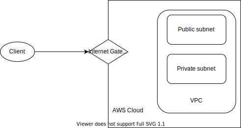

- [2022-01-25](#2022-01-25)
  - [Maven](#maven)
  - [Integer constant pool in Java](#integer-constant-pool-in-java)
  - [Git Repo](#git-repo)
  - [Google Doc](#google-doc)
- [2022-01-26](#2022-01-26)
  - [HashMap](#hashmap)
  - [Stack](#stack)
  - [Comparisons](#comparisons)
  - [Coding Example](#coding-example)
    - [Object in sorted collection](#object-in-sorted-collection)
  - [Homework](#homework)
- [2022-01-27](#2022-01-27)
  - [Class Loader](#class-loader)
  - [Garbage Collector](#garbage-collector)
    - [GC Process](#gc-process)
  - [Keywords in Java](#keywords-in-java)
  - [OOP Concepts](#oop-concepts)
  - [Exception](#exception)
- [2022-01-28](#2022-01-28)
  - [Generics](#generics)
  - [I/O Stream](#io-stream)
  - [Serialization/Deserialization](#serializationdeserialization)
  - [Java 8 Features](#java-8-features)
  - [Assignment](#assignment)
- [2022-01-31](#2022-01-31)
  - [Multithread](#multithread)
  - [Assignment](#assignment-1)
- [2022-02-01](#2022-02-01)
  - [What is database, database management system (DBMS) and SQL?](#what-is-database-database-management-system-dbms-and-sql)
  - [File system vs. DBMS](#file-system-vs-dbms)
  - [Normalization](#normalization)
  - [NoSQL](#nosql)
  - [CAP Theorem](#cap-theorem)
  - [Sharding and Replica](#sharding-and-replica)
  - [Assignment](#assignment-2)
- [2022-02-02](#2022-02-02)
  - [MongoDB](#mongodb)
  - [Redis](#redis)
  - [Memchached vs. Redis](#memchached-vs-redis)
  - [SQL vs. No-SQL](#sql-vs-no-sql)
  - [Index](#index)
  - [SQL tuning](#sql-tuning)
  - [Application tuning](#application-tuning)
  - [Assignment](#assignment-3)
- [2022-02-03](#2022-02-03)
  - [Transaction](#transaction)
  - [Concurrency](#concurrency)
  - [Isolation Level](#isolation-level)
  - [Lock](#lock)
  - [Distributed Transaction design pattern: 2PC](#distributed-transaction-design-pattern-2pc)
  - [Distributed transaction design pattern: Saga](#distributed-transaction-design-pattern-saga)
  - [Assignment](#assignment-4)
- [2022-02-04](#2022-02-04)
  - [SQL](#sql)
- [Summary](#summary)
  - [Maven](#maven-1)
  - [Git](#git)
  - [Java](#java)
  - [Database](#database)
- [2022-02-14](#2022-02-14)
  - [JDBC](#jdbc)
    - [Commit and Rollback](#commit-and-rollback)
    - [Prevent SQL injection](#prevent-sql-injection)
  - [Hibernate](#hibernate)
  - [Assignment](#assignment-5)
- [2022-02-15](#2022-02-15)
  - [Hibernate](#hibernate-1)
  - [Assignment](#assignment-6)
- [2022-02-16](#2022-02-16)
  - [TCP Protocol](#tcp-protocol)
  - [Web resources](#web-resources)
  - [Web Server](#web-server)
  - [Assignment](#assignment-7)
- [2022-02-17](#2022-02-17)
  - [HTTP Request](#http-request)
  - [Servlet](#servlet)
  - [Assignment](#assignment-8)
- [2022-02-18](#2022-02-18)
  - [Request forward](#request-forward)
  - [Forward Request](#forward-request)
  - [Reflection API](#reflection-api)
  - [Proxy design pattern](#proxy-design-pattern)
  - [Singleton design pattern](#singleton-design-pattern)
  - [Factory design pattern](#factory-design-pattern)
  - [Builder design pattern](#builder-design-pattern)
- [2022-02-21](#2022-02-21)
  - [Resources](#resources)
  - [Topics](#topics)
- [2022-02-22](#2022-02-22)
  - [Spring Introduction](#spring-introduction)
- [2022-02-23](#2022-02-23)
  - [Some interview questions](#some-interview-questions)
  - [Movie Demo](#movie-demo)
- [2022-02-24](#2022-02-24)
- [2022-02-25](#2022-02-25)
- [2022-02-28](#2022-02-28)
- [2022-03-01](#2022-03-01)
- [2022-03-02](#2022-03-02)
- [2022-03-03](#2022-03-03)
- [2022-03-04](#2022-03-04)
  - [Attacks](#attacks)
  - [Security login](#security-login)
- [2022-03-07](#2022-03-07)
- [2022-03-08](#2022-03-08)
- [2022-03-09](#2022-03-09)
  - [Some Questions](#some-questions)
  - [History and Why](#history-and-why)
- [2022-03-10](#2022-03-10)
  - [Agile paradigm](#agile-paradigm)
  - [QA/DevOps](#qadevops)
- [2022-03-11](#2022-03-11)
  - [Introduction](#introduction)
  - [Computation in Cloud](#computation-in-cloud)
  - [Global infrastructure and security](#global-infrastructure-and-security)
  - [Networking](#networking)
  - [Storage and Database](#storage-and-database)
  - [Security](#security)
  - [Monitor and analytics](#monitor-and-analytics)
  - [Migration](#migration)
- [2022-03-14](#2022-03-14)
  - [Messaging system](#messaging-system)
  - [Demo project](#demo-project)


# 2022-01-25
## Maven
The Maven repository check order:
    - local 
    - central
    - remote (private remote repositories for companies)

## Integer constant pool in Java

The `Integer` class also uses constant pool, in the range of `[-128, 127]`, or $[-2^7, 2^7 - 1]$.


## Git Repo

https://github.com/Arthur-Shuahua-Zhang/JavaBatch23

## Google Doc

https://docs.google.com/document/d/1FFk9Uxcoc603C1zHSPdGM8M5uBepfD5VQyx7GmEsKNc/edit

# 2022-01-26
## HashMap

The bucket list becomes red-black tree when the size of the list in that bucket grows more than 8.

Internally, HashSet is implemented using HashMap. HashTable is also implemented using HashMap.

The index of the bucket of `null` key is 0.

- HashTable vs. ConcurrentHashMap
  - https://stackoverflow.com/questions/12646404/concurrenthashmap-and-hashtable-in-java

Interface oriented coding (type declared as interface).

## Stack
Stack is implemented using circular array internally?

ArrayDeque (implemented using circular array)

You can also use LinkedList to implement the Deque interface:  `Deque<Integer> stack = new LinkedList<>()`


## Comparisons
**List vs. Set**
|List|Set|
|---|---|
|Ordered sequence|Unordered sequence|
|Allows duplicate|Doesn't allow duplicate|
|Provides random access|No random access allowed|

**HashTable vs. ConcurrentHashMap**
- HashTable uses single lock for the whole map, while the latter uses multiple locks on segment level (16 by default) instead of object level.
- In ConcurrentHashMap, locking is applied only for updates. In case of retrievals, it allows full concurrency, retrievals reflect the results of the most recently completed update operations. So reads can happen very fast while writes are done with a lock.

## Coding Example

### Object in sorted collection

Your custom object should implement the Comparable interface to define the way to compare the custom object (implements the Comparable interface).

Or you need to provide the Comparator when you define the sorted collection.

Comparator overflow issue (better not to use `o1.val - o2.val` directly)

You can try to define the comparator for a TreeMap using sorted Value.

## Homework

- What is JVM
- Play around the comparator, comparable, data structures, and upload to github account.

# 2022-01-27
## Class Loader
- Application class loader
- Extension class loader
- Bootstrap class loader
  - What classes does those loader load?

## Garbage Collector
- Serial GC
  - It has a single thread in the environment. When this thread runs, other threads will be paused and let the serial GC do the work.
  - -XX:UseSerialGC
- Parallel GC
  - It is the default GC
  - It works in parallel.
  - -XX:UseParallelGC
- G1 GC
  - Divide the whole heap into equal sized chunks, it will prioritize the different chunks by the number of garbages each chunk has.

### GC Process
The heap has three generations:
- Young generation
  - Eden
    - Newly allocated object will be put into Eden. When the Eden region is full, minor GC will be triggered, unreferenced object will be garbage collected, referenced object will be put into S0.
  - S0
    - If S0 is full, GC will be triggered, unreferenced object will be removed from S0 and Eden. Referenced object will be moved to S1.
  - S1
    - If S1 is full, referenced object will be moved to S0, while unreferenced object in Eden, S0, S1 will be removed.
- Old generation
  - If object in young generation ages to a certain threshold (aging), it will be moved to old generation.
  - Tenured
- Permanent generation
  - Permanent

## Keywords in Java
- Final
- Immutable class: a class that is not mutable
  - Make the class as final
  - All the fields are private final
  - No setter method
  - If collections present in private field, returns a deep copy of the field
- static
  - blocks
    - A static block is a set of instructions that is run only once when a class is loaded into memory. A static block is also called a static initialization block. This is because it is an option for initializing or setting up the class at run-time.
  - variable
    - The variable is shared with all instances of the class
  - methods
    - The method belongs to a type, instead of an instance
  - class
    - A static class is really a class within a class (static nested class), one example is `Map.Entry<>`, which is a static class. `static` modifier can only be used on a nested class (i.e. no top-level static class).
    - A static class is simialr to a class that is both abstract and sealed. A static class cannot be instantiated (no instance constructor) or inherited and all the members of the static class are static in nature.
    - 
- native
  -  It is applied to a method to indicate that the method is implemented in native code using JNI (Java Native Interface). native keyword is only applicable for methods. A native method indicates that it is implemented in platform-dependent code (e.g. C/C++)
  - Main purpose of using native keywo    
    - To improve the performance of the system
    - to achieve machine level/memory level communication
    - To use already existing legacy non-java code


**Assignment**: Do some research of Java's keyword.

## OOP Concepts
- Abstraction
  - Use abstract class or interface
- Encapsulation
- Inheritance
- Polymorphism

Access modifier
- public
- protected
- private
- default (leave the modifier empty)

## Exception
- Checked exception
- Unchecked exception
- Exception pipe (handle multiple exceptions)
- Try with resources (implement AutoCloseable interface (override the close9) method), so resources inside the try block will automatically close themselves if anything happens)

# 2022-01-28
## Generics
- Advantages
  - Code is more concise, easier and less error-prone
  - Enforce type correctness at compile time
  - Without causing any extra overhead to the application

## I/O Stream
- Byte stream
- Character stream

## Serialization/Deserialization
- Serialization ID is used to uniquely identify the class.
- `static` field of an object will not be serialized too

## Java 8 Features
- Lambda expression
- Functional interface
  - Four important functional interface
    - Predicate: `public Boolean test(T t)`
      - It represents a boolean-valued function of one argument
      - `test(T t)` is used to pass in the object `t` being tested
      - Often used in `filter()` to filter out certain objects.
      - Predicates can be combined using `and()`/`or()` to form a complex predicate.
      - The `BiPredicate<T, U>` is similar with `Predicate<T>`, except BiPredicate accepts two objects as argument.
    - Function: `public R apply(T t)`
      - It represents a function that accepts one input and produces a result. `T` is the data type of the input, and `R` is the data type of the output.
      - `apply(T t)` is used to "call" the instance of the function, and pass in the argument `t`.
      - You can create a `Function` instance by using lambda expression, here is an example:
      ```java
      Function<Integer, Integer> addOne = num -> num + 1;
      ```
      - `andThen(Function<T, R>)` can be used to chain two functions together. For example:
      ```java
      Function<Integer, Integer> addOneMultiplyTen = addOne.andThen(num -> num * 10)
      ```
      The above statement creates a function entity that add one to the argument, then the result is multiplied by 10.
      - The `BiFunction<T, U, R>` is similar with `Function<T, R>`, except it takes two argument instead of one.
    - Consumer: `public void accept(T t)`
      - It represents an operation that accepts a single input argument and returns no result. The type of the argument is `T`.
      - `accept(T t)` is used to pass the object `t` being consumed to consumer.
    - Supplier: `public R get()`
      - It represents a supplier of results `R`.
- Optional
- Stream API
  - Intermediate operation (returns a stream as result)
    - `filter(Predicate<T>)`: Returns a stream consisting of the elements of this stream that match the given predicate.
    - `map(Function<T, R>)`: Returns a stream consisting of the results of applying the given function to the elements of this stream.
    - `flatmap(Function<T, ? extends Stream<? extends R>>)`: Returns a stream consisting of the results of replacing each element of this stream with the contents of a mapped stream produced by applying the provided mapping function to each element (results in the mapped stream `Stream<R>` will be flattened to a single stream)
    - `distinct()`: Returns a stream consisting of the distinct elements (according to `Object.equals(Object)`) of this stream.
    - `sorted(Comparator<T>)`: Returns a stream consisting of the elements of this stream, sorted according to the provided Comparator. If no comparator is provided, will use the natural order of the object to sort (must override `compareTo()`)
    - `peek(Consumer<? super T> action)`: Returns a stream consisting of the elements of this stream, additionally performing the provided action on each element as elements are consumed from the resulting stream.
  - Terminal operation (returns non stream)
    - `T reduce(T identity, BinaryOperator<T> accumulator)`: the `reduce()` operation allow us to product one single result from a sequence of elements, by repeatedly applying a combining operation to the elements in the sequence.
    - `boolean anyMatch(Predicate<? super T>) predicate`
    - `boolean allMatch(Predicate<? super T> predicate)`: Returns whether all elements of this stream match the provided predicate. May not evaluate the predicate on all elements if not necessary for determining the result. If the stream is empty then true is returned and the predicate is not evaluated.
    - `void forEach(Consumer<? super T> action)`
    - `collect(Collector<? super T, A, R>)`: collect elements of this stream using a `Collector`
    - `long count()`: Returns the count of elements in this stream
    - `Optional<T> findFirst()`: Returns an Optional describing the first element of this stream, or an empty Optional if the stream is empty. If the stream has no encounter order, then any element may be returned.
    - `Optional<T> min(Comparator<? super T>)`: Returns the minimum element of this stream according to the provided Comparator. This is a special case of a reduction.
    - `max()`
    - `sum()`
    - `average()`
## Assignment
- Generics
  - why `List<int> arr = new ArrayList<>();` caused error? (because type erasure)
  - Type erasure
  - `<T extends E>`
  - `<? extends E>`
  - `<? super T>`
- I/O Stream
  - Character stream demo
- Functional interface demo
  - Predicate
  - Function
  - Consumer
  - Supplier
- Java8
  - Stream API Demo (10)
    - `map`
    - `flatmap` difference between `map`
    - `filter`
    - `distinct`
    - `limit`
    - `forEach`
    - `collect` etc
  - Method reference demo (class::method)
  - Additional features

# 2022-01-31
## Multithread
**Process vs. Thread**
- Process
  - Independent memory space, stack, heap and OS resources
- Thread
  - Shared memory space
  - private stack, program counter, register

**Thread state**
- new
  - A thread is just created but now started yet
- runnable
- blocked
  - Blocked at a lock (trying to access a critical point)
- waiting
  - `Object.wait` with no timeout
  - `Thread.join` with no timeout
  - `park()`
- timed_waiting
  - `Thread.sleep()`
  - `Object.wait` with timeout
  - `Thread.join` with timeout
  - `park()` with timeout
- terminated

**Thread creation**
- Extends `Thread`
- Implements `Runnable`
  - No return value
  - A `Runnable` task can be executed by Thread or ExecutorService
- Implements `Callable<T>`
  - Has one return value of type `T`.
  - A `Callable<T>` task can only be executed by ExecutorService, by using `executorService.submit(Callable<T> task)`, `invokeAll()`, `invokeAny()`
  - The `submit()` method will return a special result of type `Future`, which can be used to retrieve the return result of the callable task.
    - We can call `future.isDone()` to check if the method has finished the execution and returned the result 
    - We can call `future.get()` to get the result of the executed task.
      - Calling the method `get()` blocks the current thread and waits until the callable completes.
      - We can pass in a timeout amount, so the current thread will only be blocked for that amount of time. For example: `future.get(1, TimeUnit.SECONDS)`.
  - The `invokeAll()` method accepts a collection of `Callable` and returns a list of `Future`.
  - The `invokeAny()` method accepts a collection of `Callable`, it will block the current thread, until the first callable terminates and returns the result of that callable (notice it is not returning a `Future`, but the actual result of the `Callable` task).
- Thread pool

**`Runnable` vs `Callable`**
- no return / has return
- no exception / has exception
- override `run()` / override `call()`

**Thread pool**
- Customized thread pool
- `ThreadPoolExecutor`
  - `corePoolSize`
  - `maximumPoolSize`
  - `keepAliveTime`
  - `unit`
  - `workQueue`
  - `threadFactory`
  - `handler`: different rejection policies (invoked when there is not enough thread to execute new task (queue is full and max pool size is reached))
    - AbortPolicy (the default handler policy)
    - CallerRunPolicy
    - DiscardPolicy
    - DiscardOldestPolicy

- Builtin thread pool
  - Fixed thread pool
  - Single thread pool
  - Cached thread pool
  - Scheduled thread pool

**Lock**
- Two ways to implement a lock
  - Use `synchronized` keyword
    - It is used with:
      - block of code (object level lock?)
      - method (object level lock)
      - static method (class level lock)
      - class
    - Object level lock, class level lock
  - Implements the `Lock` interface:
    - `ReentrantLock`

Three classes implements `Lock` interface:
- `ReentrantLock`
  - `lock()`: call this method to try to acquire the lock. If the lock is not available, thread will be dormant until the lock is available.
  - `isLocked()`: 
  - `unlock()`: call this method to unlock the obtained lock
  - `tryLock()`: try to acquire the lock without pausing the current thread. If the lock is held, then the method will return `false` immediately (no block).
  - `newCondition()`
  - `lockInterruptibly()`: acquire the lock unless the current thread is interrupted.
- `ReentrantReadWriteLock.ReadLock`
- `ReentrantReadWriteLock.WriteLock`


## Assignment
- Write study notes for multithreading and lock, including high level explaination
- Lock
  - Understand the lock concept, what does each keyword mean
  - Future / completeable future
  - Write demo code

- `Future` vs. `CompletableFuture`
  - `Future` is used as a reference to the result of an asynchronous computation. We can use `isDone()` to check if the computation is done or not. To get the result of the computation, we can use `get()`.
  - `CompletableFuture` is an extension to `Future`. It is a class that implements `Future` interface and `CompletionStage` interface, providing additional APIs for managing asynchronous computation, e.g. manually completion, creating, chaining and combining multiple `Futures`.

# 2022-02-01

## What is database, database management system (DBMS) and SQL?
- Database is an organized collection of structured information, or data, typically store electronically in a computer system.
- DBMS is a software designed to store, retrieve and manage data in the database
- SQL is short for Structured Query Language. It is a language for managing data held in a relational DBMS.

## File system vs. DBMS
||File System|DBMS|
|---|---|---|
|Usage|Manages files in a storage medium within a computer|Managing the database|
|Data redundancy|Has redundant data|No redundant data|
|Backup and recovery|No backup and recovery mechanism|Has backup and recovery mechanism|
|Query processing|Inefficient|Efficient|
|Consistency|Lower data consistency|Higher data consistency|
|Complexity|Less complex|More complex|
|Security|Less security|More security|
|Cost|Less expensive|More expensive|

## Normalization
**What is normalization?**
- Normalization is a technique of organizing the data in the database. Normalization is a systematic approach of decomposing tables to eliminate data redundancy and undesirable characteristics like insertion, update and deletion anomalies.

**The first three normalization form**
- 1st normal form
  - Each column should have atomic values
  - Each column should have unique name
  - Each column should have value of the same type
  - The order in which data is saved doesn't matter
- 2nd normal form
  - The table should be in 1st normal form
  - Table should not have partial dependency (each attribute describes primary key)
    - For example, if the table's primary key is `student_id` and `subject_id` (the table stores student's score), then other columns in this table should depend on both of the two primary keys, not one of them. So if a column is `teacher_name`, it is not in 2nd normal form, because it depends on `subject_id` only. This is called partial dependency.
- 3rd normal form
  - The table should be in 2nd normal form
  - Table should not have transitive dependency (each attribute should not describe non-primary key)
    - Transitive dependency means, a non-prim attribute depends on other non-prime attributes, rather than depending upon the primary attributes or primary key. In another word, a column can be uniquely ideitified using another non-primary key column, instead of using primary key alone.
    - For example, a table `student` uses `id` as the primary key. It has a column `age` and a column `birth date`. This table has transitive dependancy since the `age` column can be uniquely identified using a non-primary key `birth date`.

## NoSQL
**Advantages of NoSQL**
- Handles big data efficiently
- Data models: no predefined schema
- Data structure: NoSQL handles unstructured data (data stored can have different data structure)
- Cheaper to manage
- Scaling: scale out / horizontal scaling

**Advantages of RDBMS**
- Better for relational data
- Normalization: organizes the data in a way that limits the redundancy, results in better performance
- Well known language (SQL)
- Allows data integrity rules (using constraints)
- ACID compliance (atomicity, consistency, isolation, durability)

**Types of NoSQL**
- Document databases
  - Stores data in format like JSON objects
  - MongoDB, CouchDB
- Column databases
  - Optimized for reading data in columns, instead of rows
  - Apache Cassandra, Hbase
- Key-Value stores
  - Data maintained as key-value pair
  - Very fast, for huge dataset
  - Redis, Couchbase server, Riak
- Cache systems
  - Redis, Memcache
- Graph databases
  - Data in a graph database is seen as a node
  - A node can have relationship with other nodes (edge)
  - Huge data set with relations (social networks)
  - Neo4J, GraphDB

## CAP Theorem
It formalizes some useful limits on reliability. CAP stands for Consistency, Availability, Partition Tolerance. It formalizes the trade-off between consistency and availability in the presence of partitions.
- Consistency
  - All clients always have the same view of the data
- Availability
  - Each client can always read and write
- Partition Tolerance
  - The system can work well in the presence of physical network partitions
  - The system continues to operate despite an arbitrary number of messages being dropped (or delayed) by the network between nodes.
  - When a network partition failure happens, it must be decided whether to
    - Cancel the operation and thus decrease availability but ensure consistency
    - Proceed with the operation and thus provide availability but risk inconsistency.

We can only provide two of the three guarantees mentioned above.
- Consistency + Partition tolerance
  - Prioritizes partition and consistency of data in the sarcrifice of availability
  - MongoDB, Hbase, BigTable, Redis
- Availability + Partition tolerance
  - Prioritizes availability and partition in the sarcrifice of consistency
  - Dynamo, Cassandra, SimpleDB, CouchDB

## Sharding and Replica
**Sharding**
- Sharding is the practice that distributes a single logical database across a cluster of machine.
- Problems in Sharding
  - Joins across shardings
  - Fixed number of shards (can be solved by splitting shards into smaller shards)
- Master-Slave architecture

**Replica**
- Use redundancy to provide failover
- May increase availability (CAP theorem)

## Assignment
- Finish all the assignments about Java on LMS (2022/02/03)

# 2022-02-02
## MongoDB
**Architecture**
- Mongod: database instance
- Mongos: sharding process
  - Analogous to a database router
  - Process all the request based on information in the config server
  - decide how many/which mongods should receive the query
- Mongo: interactive shell

**Functionality**
- Document based database
- Dynamic schema
- Secondary indexes
  - A secondary index, put simply, is a way to efficiently access records in a database (the primary) by means of some piece of information other than the usual (primary) key.
- Primary-secondary node with automated failover
- Built-in horizontal scaling via automated range based partitioning of data (sharding)
- Follows CP (Favor Consistency-Partition Tolerance over Availability)

**MongoDB Atlas**
- MongoDB Atlas is a multi-cloud database service.

## Redis

Redis stands for Remote Directory Server. It is Key-Value store NoSQL database

**Redis feature**
- In memory database
- Key-Value data store
- Supports storing value in different kinds of data structure
  - String
  - List
  - Sets
  - Sorted sets
  - Hashes

**Usage**
- Cache
- Distributed lock
- Message queue (not recommended)
- Store configuration information

Why Redis is powerful? It supports two kinds of persistence mechanism:
- RDB (Redis Database File): the RDB persistence performs point-in-time snapshots of database at specific intervals.
- Journaling via AOF (append only file): the AOF persistence logs every write operation received by the server, what will be played again at server startup, reconstructing original dataset

## Memchached vs. Redis
Memchached and Redis are both in memory Key-Value store NoSQL database. **Similarities**
- Sub-millisecond latency: they keep data in memory, so they are very fast
- Data partitioning: both allow distributing data across multiple nodes
- Support for a broad set of programming languages (Java, Python, JavaScript, C, Ruby)
- High scalability: both of them offer high scalability to handle large data

**Differences**
- Advanced data structures
  - Memcached stores key-value pairs as a string and has a 1MB size limit per value.
  - Redis supports other data structure such as list, set, sorted set, hash. It can store values of up to 512MB in size.
- Multithreaded architecture
  - Memcached has a multi-threaded architecture. It performs better than Redis when storing larger datasets.
  - Redis is single-threaded (except for asynchronous data persistence task)
- Disk I/O dumping
  - Memcached does not support disk dumping. Third-party tools are required to perfom such task.
  - Redis provides highly configurable mechanisms like RDB (snapshot and save Redis database file) or AOF (journaling via append-only files).
- Replication
  - Memcached does not support replication. Third-party forks (like repcached) have implemented this feature.
  - Redis supports replication out-of-the-box.
- Transaction
  - Memcached does not support transactions, although its operations are atomic.
  - Redis supports for transactions to execute commands.
- Publication/Subscription messaging
  - Memcached does not support pub/sub messaging.
  - Redis provides functionality to publish and subscribe to messages using pub/sub message queues.
- LUA scripting
  - Memcached does not support LUA scripting
  - Redis provides commands like `EVAL` and `SCRIPT LOAD` which are useful for the execution of the LUA scripts.
- Geospatial support
  - Memcached does not support geospatial feature.
  - Redis provides commands to manage real-time geospatial data.

Generally speaking, Redis outperforms memcached by offering richer functionality and various features that are promising for complex use-cases.

## SQL vs. No-SQL
|SQL|NoSQL|
|---|---|
|For relational database|For non-relational database|
|Pre-defined schema|Dynamic schema|
|Can scale vertically|Can scale horizontally|
|ACID principle|CAP theorem|
|Not suited for hierarchical data store|Suited for hierarchical store|


## Index
Indexing is a way to optimize the performace of database by minimizing the number of the disk access required when a query is processed.
- Clustered index (primary index)
  - It defines the order in which data is physically stored
  - Only one clustered index per table
  - When you apply primary key to a column, that column (primary key) will automatically become clustered index
- Non-clustered index (secondary index)
  - Can have multiple non-clustered index
  - Doesn't sort the physical data in table
  - Non-clustered index node stores the reference to the physical record

**Data structures**
- B+ tree
- Bitmap
- Hashtable
- R tree


## SQL tuning
SQL tuning: database tuning describes a group of activities used to optimize and homogenize the performance of a database. It usually overlaps with query tuning, but refers to design of the database files, selection of the database management system application, and configuration of the database's environment.

Some tips:
- Using execution plan to identify the cause of slowness
  - Execution plan is a set of instructions that describes which process steps are performed while a query is executed by the database engine.
  - You can use tools supported by the DBMS to generate the execution plans. For example, in PostgreSQL, you can use command `EXPLAIN` to generate the execution plan for specified statement.
- Try to reduce joins, remove unused join and join conditions
- Use the index to improve the performace
- Union all instead of union
- Use `LIMIT`
- Use View or stored procedure

## Application tuning
- Check the DB query
  - do the SQL tuning
- DB connection usage
  - check the connection pool
- Do JVM tuning
  - Jstack, JMap, JConsole
- Server side
  - CPU, memory usage by using commands like `top`, `ps`
- Code review
- Check networking, firewall, load balancer

## Assignment
- memcache vs. redis (when should we use which)
- AWS: Elastic Cache
- SQL/Application Tuning
  - view vs. stored procedure
  - view vs. material view


# 2022-02-03
## Transaction
A transaction is an action, or a series of actions, carried out by a single user or an application. Transaction should follow the ACID principle:
- A: Atomicity
  - All transactions are atomic. 
  - The transaction can't be executed partially.
  - Only two states possible: Commit or Rollback
- C: Consistency
  - Transactions take the database from one consistent state to another state
- I: Isolation
  - A transaction is not visible to other transactions until it completes
- D: Durability
  - Once the transaction has completed, its changes are made permanent.

A transaction example. We transfer money from account A to account B. The steps are:
- Read A
- A = A - 100
- Write A
- Read B
- B = B + 100
- Write B

The illustration of ACID principle in this example is:
- Atomicity: all these steps must be atomic. You can't do A - 100 without doing B + 100
- Consistency: A + B should be the same
- Isolation: other queries shouldn't see A or B's change until the transaction is completed
- Durability: after finishing the commit, money doesn't go back to A

## Concurrency
Problems in concurrency:
- Dirty read: read uncommitted data from another transaction
- Non-repeatable read: two reads are not consistent. Read committed data from an update query from anther transaction (doing update operation, two reads are before and after the update, the data read is inconsistent)
- Phantom read: two reads returns different number of results. Read commited data from insert or delete query from another transaction (doing insert or delete operation. Two reads are before and after insert/delete operation)

We use the different isolation level to avoid those problems.

## Isolation Level
Isolation level means the how two concurrent transactions are isolated with each other.

|Isolation Level|Dirty Reads|Unrepeatable Reads|Phamtom Reads|
|---|---|---|---|
|Read uncommited|Y|Y|Y|
|Read commited|N|Y|Y|
|Repeatable Read|N|N|Y|
|Serializable|N|N|N|

Different isolation levels can avoid the above mentioned problems at different level.

## Lock
**Binary lock**
- The lock has two values, 1 and 0, represents locked or not locked
- Use an additional column `locked` to store the lock the each row. If the value in this column is 1, it means that row is locked. Otherwise, it is not locked.

**Shared and exclusive lock**
- Share lock: also known as read lock (multiple transactions can have the read lock, because the record can be read concurrently)
- Exclusive lock: write lock (it is exclusive, only one transaction can obtain the lock)

**Optimistic lock**
- The optimistic lock strategy is when you read a record, take note of a stamp/version number. When you want to read/write to that record, check if the stamp has changed. If it has changed (it means the record is dirty), the transaction should be aborted
- This strategy is most applicable to high-volume systems and three-tier architectures where you do not necessarily maintain a connection to the database for your session. In this situation the client cannot actually maintain database locks as the connections are taken from a pool and you may not be using the same connection from one access to the next.
**Pessimistic lock**
- Pessimistic lock will lock the record for you exclusively until you have finished all the transaction operation. It has better integrity than optimistic lock at the expense of more overhead.

**Deadlock**
- A deadlock is a state in which each member of a group waits for another member, including itself, to take action
- Can be detected by checking if there is any cycle in the wait-for-graph 

## Distributed Transaction design pattern: 2PC
Two phase commit is a design pattern for distributed transaction.
- Phase 1: prepare phase
  - The coordinator will send prepare message to the servers involved in the distributed transaction. After each server is prepared, a prepared signal will be sent back to the coordinator. So coordinator will know all the server will be ready to do the transaction.
- Phase 2: commit phase
  - The coordinator will send commit signal to all the servers to actually do the transaction. After the commit is done on one server, the signal will be sent back to coordinator. When the transaction is done (coordinator receives all the done message), coordinator will end the transaction.

One problem for 2PC is that the coordinator will wait for some servers to respond. It may wait indefinitely. We can use other design pattern to solve this problem (e.g. Saga design pattern).

## Distributed transaction design pattern: Saga
The Saga design pattern is a way to manage data consistency across microservices in distributed transaction scenarios. A saga is a sequence of transactions that updates each service and publishes a message or event to trigger the next transaction step. If a step in the sequence fails, the saga executes compensating transactions that counteract the preceding transactions.

**Transaction types in Saga**
- Compensable transaction: transactions that can potentially be reversed
- Pivot transaction: if the pivot transaction commits, the saga runs until completion.
- Retryable transactions: they are transactions follow the pivot transaction and are guaranteed to succeed.

**Two common implementation approaches**
- Choreography
  - Event based
  - Saga participants exchange events without a centralized control.
  - Each local transaction publishes domain events that trigger local transactions in other services.
- Orchestration
  - Command based
  - Use a centralized controller (saga orchestrator) tells the saga participants what local transactions to execute.
  - The saga orchestrator handles all the transactions and tells the participants which operations to perform based on the events. It also handles failure recovery with compensating transactions.

## Assignment
- Transaction
  - What is transaction?
  - How does transaction works on different server (distributed transaction)
- Lock
  - What is optimistic lock
  - What is pessimistic lock
  - How to solve the deadlock 
  - (?) What is live lock
  - (?) 2PL (two phase locking).
- Distributed transaction
  - Saga design pattern 

# 2022-02-04
## SQL
- DDL (Data Definition Language)
  - Create, drop, alter, truncate
- DQL (Data Query Language)
  - select
- DML (Data Manipulation Language)
  - insert, update, delete
- DCL (Data Control Language)
  - grant, revoke (manage the priviledge of database users)
- DTL (Data Transaction Language)
  - commit, rollback

SQL
- Get familiar with the basic SQL clause
- Group by
  - Use `Having` to define the condition of grouping
- Aggregation function (`group by`)
  - max, count, min, avg, sum
- Subquery
  - Group the subquery into parenthese
- `rank()` vs. `dense_rank()`
  - `dense_rank()` only ranks non-equal entity
- union, union all, intersect, minus
- join, left join, right join, inner join, outter join
- Difference between union and join
  - Union: row-wise combination
  - Join: column-wise combination


# Summary
## Maven
- Local, central, remote repository
- The life cycle of Maven
- Command line for Maven

## Git
- How to use git in intellij
- How to use git in terminal
- Git workflow

## Java
- Primitive type
  - `byte`, `short`, `int`, `long`, `float`, `double`, `boolean`, `char`
- Wrapper class
- Autoboxing and unboxing
- String / StringBuilder / StringBuffer
- String, Integer constant pool
- `equals()` / `hashCode()`
  - We should always override both of them
- Collection
  - List
  - Set
  - Queue
  - Map
  - Comparing between collections
    - List vs. Set
    - ArrayList vs LinkedList
    - heap: PriorityQueue
    - deque: ArrayDeque
    - HashMap vs. HashTable vs. ConcurrentHashMap
    - HashSet, TreeSet, LinkedHashSet
    - TreeMap, LinkedHashMap
    - Stack, Queue
    - Binary tree, balanced binary tree
- Comparator vs. Comparable
  - Which method to override
  - In which case you need what?
    - `Comparable` interface enables the internal natural order of the class
- JVM
  - Classloader
    - How does class loader load classes
    - Bootstrap, Extension, Application
    - Three phases
      - Loading
      - Linking
      - Initialization
  - Runtime data area
    - Method areas
    - Heap
    - Stack
    - PC register
    - Native method stack
  - Execution engine
    - Interpreter
    - JIT compiler
    - Garbage Collector
  - Native
    - Native method interface
    - Native method library
- Garbage Collector
  - Types of GC
    - Serial GC
    - Parallel GC
    - G1 GC
    - CMS GC (deprecated since Java 9, removed in Java 14)
  - GC Process
    - What object stored in each of the following generations? What is the process goes like?
    - Young Generation
      - Eden
      - S0
      - S1
    - Old Generation
    - Permanent Generation
  - Minor GC, Major GC
- Keywords (know all the keywords)
  - 53 keywords
  - Reserved literals: `true`, `false`, `null`
  - Unused keywords: `goto`, `const`
  - 48 used keywords
    - Primitive type (8)
    - Control flow
  - final, finally, finalized
  - volatile
  - static
  - implements vs extends
  - immutable class
  - throw vs. throws
- OOP
  - Abstraction
    - Abstract class
    - Interface
  - Encapsulation
    - Private
    - Setter, getter
  - Inheritance
    - Extends
    - Implements
  - Polymorphism
    - Override
    - Overload
  - Access modifier
    - Public
    - Protected
    - Default
    - Private
- Exception
  - Checked exception vs. Unchecked exception
    - Examples of checked exception
      - IOException
      - ClassNotFoundException
    - Examples of unchecked exception
      - NullPointerException
  - Exception vs. Error
  - How to handle exception
  - How to customize exception
  - How to define the order of handling multiple exceptions
  - Try-with resources
    - All the resources in the try-with block should implement the autoclosable interfac and override the `close()` method
- Generics basics
  - What is generics
  - How do we use generics 
  - Advantages
  - Disadvantages
  - E vs. ?
    - Difference? When should we use what
    - `? extends E` meaning
  - Type erasure
- IO stream
  - Byte stream
  - Character stream
  - InputStream
  - OutputStream
  - Reader
  - Writer
  - File
- Serialization and Deserialization
  - To make a class serializable, we must implements the mark interface `Serializable`
  - Use `ObjectInputStream` to serialize 
  - Use `ObjectOutputStream` to deserialize
  - Define the serialization ID
  - Keyword `transient` meaning
- Java 8 features
  - Lambda (What? Why? How?)
    - Objects created by lambda is immutable, and it is thread safe
  - Functional interface
    - `@FunctionalInterface`
    - Predefined functional interface
      - Predicate -> `test`
      - Function -> `apply`
      - Consumer -> `accept`
      - Supplier -> `get`
  - Optional
    - What? Why? How?
    - `of`, `ofNullable`, `orElse`, `orElseThrow`
  - Stream
    - What? Why? How?
    - Intermediate operation for elements in the collection
    - Terminal operation
    - API
      - `map` vs. `flatmap`
      - Convert list to map
  - Method reference
- Multi thread
  - Process vs. Thread
  - Thread state
    - New
    - Runnable
    - Wait
    - Timed_wait
    - Block
    - Terminated
  - How to create thread
    - Extends `Thread`
    - Implement `Runnable`
    - Implement `Callable`
    - Thread pool
  - Thread pool
    - What is thread pool
    - Customized thread pool
      - ThreadPoolExecutor
        - `corePoolSize`
        - `maximumPoolSize`
        - `keepAliveTime`
        - `unit`
        - `workQueue`
        - `threadFactory`
        - 
        - Details for ea ch parameter
    - Built-in thread pool (what is the difference between them, use case for each one)
      - `newFixedSizedThreadPool`
      - `newSingleThreadPool`
      - `newCachedThreadPool`
      - `newScheduledThreadPool`
  - Lock
    - `synchronized` keyword
      - Difference of using `synchronized` on static method and non-static method
    - Lock interface
      - Reentrant lock
    - `ReadWriteLock` interface
      - ReentrantReadWriteLock
- Enum

## Database

- Database vs. DBMS vs. SQL
- File system vs. database
- Database normalization
- Major categories of No-SQL
  - Document data store
    - e.g. MongoDB
  - Key-value data store
    - e.g. Redis
  - Graph
  - Columnar
- CAP principle
  - C:
  - A:
  - P:
- Sharding vs. Replica
  - Sharding: improve performance
  - Replica: avoid failure
- MongoDB
  - Architect
  - Functionality
  - Usage
  - Sharding and replica
- Redis
  - How does it is used as a cache
  - Other functionalities Redis provide
  - Data structures Redis supports
  - Persistence mechanism
  - Usage
    - As message queue (not recommended)
    - Configuration server (?)
- SQL vs. No-SQL
- Index
  - Clustered index
  - Non-clustered index
- Data structures 
  - B tree
  - B+ tree
- SQL / Application tuning
  - view vs. stored procedure
  - view vs. materialized view
- Transaction
  - ACID principle
    - A:
    - C:
    - I:
    - D: 
- Concurrency
  - Problems
    - Dirty read
    - Non-repeatable read
    - Phantom read
  - Isolation level
    - Levels
    - Tradeoffs 
- Lock
  - Binary lock
  - Shared lock
  - Exclusive lock
  - Optimistic lock
  - Pessimistic lock
  - Dead lock
    - How to detect dead lock
    - How to prevent dead lock
- Distributed transaction
  - Design patterns, when should we choose which one
    - 2PC
    - Saga
- SQL


# 2022-02-14
## JDBC
Steps to use JDBC to connect to database
- Allocate a connection object, for connecting to the database
- Allocate a statement object, based on the connection
- Write the sql query and execute the query
- Process the query result
- Close the statement and connection object to free up the resources

[The JDBC demo](https://github.com/Arthur-Shuahua-Zhang/JDBC-Demo)

### Commit and Rollback
Have to set the auto commit to false, so we can manually make the commit.
```java
conn.setAutoCommit(false);
```
Check `JdbcTransactionTest.java` for demo.

We can use the `rollBack()` in the catch block if there is anything wrong happened in the try block.

### Prevent SQL injection
Using prepared statement to avoid sql injection. See `JdbcPreparedStatementTest.java` for details.

## Hibernate
Higher level of database abstraction. Object Relational Mapping.
- What is ORM
  - ORM can establish the relationship between a Java object and a database table.
- ORM Libraries
  - Hibernate
  - Sequelize
  - MyBatis
  - Doctrine 2
  - SQL Alchemy

## Assignment
Difference between
- Statement
- Prepared statement
- Callable statement

Setup local mysql database and try the CRUD operation

# 2022-02-15
## Hibernate

## Assignment
- Hibernate demo (use different ddl policy to create tables?)
- Query in Hibernate
  - HQL
  - Criteria query
  - Native sql

# 2022-02-16
## TCP Protocol
- 3-way handshake
- Transmission
- Close a TCP connection
## Web resources
- Static resources
- Dynamic resources

## Web Server
- Tomcat
- Jboss
- GlassFish
- Resin
- WebLogic

## Assignment
- Create google doc about the learning road map
  - JDBC
    - Work on the demo project of basic JDBC functionality
  - Hibernate
    - Work on the demo project of basic Hibernate functionality
    - Explore HQL
    - Hibernate caching
  - Review TCP protocol
  - Web server
    - What does web server achieve
    - 

# 2022-02-17
## HTTP Request
- Different types of request
  - GET request
  - POST request
  - DELETE request
- Response code
  - We need to use different codes for more information, see [HTTP response](https://developer.mozilla.org/en-US/docs/Web/HTTP/Status)
    - 200
    - 201
    - 202
    - 203
    - 204
    - ...

## Servlet


## Assignment
- Create and update the daily report google doc

# 2022-02-18
## Request forward
Servlet request forward.

## Forward Request

## Reflection API

## Proxy design pattern
- Static proxy
- Dynamic proxy (use reflection APIs)

## Singleton design pattern

## Factory design pattern

## Builder design pattern

# 2022-02-21
## Resources
- Study road map
- [Antra Java Repository](https://github.com/AntraJava)

## Topics
- OSI models (7 layers)
  - Application
  - Presentation
  - Session
  - Transport
  - Network
  - Data link
  - Physical
- Java EE
  - It is a specification for creating web server (listening to a port, processing the request, etc.)
- Tomcat
  - It is a web server that implements Java EE specification. It handles the server logics.
  - Servlet
    - The class that provides business logic in the web server (this portion of code is executed after web server receives and parsed the incoming request)
    - We need to implement business logic using a `Servlet`
    - Tomcat will invoke servlet we define when received a request to the specific url we declared in that servlet
- HTTP structure
  - Request
    - Header
    - Body
  - Response
    - Header
    - Body

# 2022-02-22
## Spring Introduction

# 2022-02-23
## Some interview questions
- What is the advantage of Spring
  - Spring is using factory design pattern (hiding the creation of objects)
- Bean scope
  - Singleton: default bean scope
  - Prototype
  - Session
  - Request
  - Application
  - Websocket
- Injection type
  - Field injection
    - It was popular before SpringBoot 2.0
    - Not recommended now because it can not be unit-tested easily
    - Does not have flexibility (in constructor and setter we can define additional logics)
    - May cause `null` pointer exception, because the injection allows a certain component bean is null, before the bean is used (instantiated).
  - Constructor injection
    - The constructor injection requires all beans are present (not null) when creating a bean
    - Recommended dependancy injection (easy for testing)
  - Setter injection
    - Not used very often
- Configuration class
  - Use it to add beans (use `@Bean` annotation together with method defined in configuration class to specify a bean of some types in library (for example `List`)).
    - The method name is the default bean name
    - We can add the bean name in the `@Bean("")` annotation to specify the bean to be created
    - We can use `@Primary` annotation to specify the default bean of some type
- AOP
  - Not very object orienated programming
    - May not easy to read (do not write your own AOP code)
    - Hard to debug
    - Better not write your own AOP
  - Internally, AOP uses Proxy design pattern
  - What is AOP (be able to explain the concepts)
  - Predefined AOP annotations
    - `@Secured("ROLE")` checking for APIs (use AOP)
    - `@Transactional`

## Movie Demo
- Create the repository class of our own (use `EntityManager` to handle the mapping between entity and database table).

# 2022-02-24
Continue discussing the basic structure of a Spring app (REST APIs).

An important REST APIs demo: [Antra REST API Demo](https://github.com/AntraJava/RestDemo).

# 2022-02-25
- `VO`: Value Object, only used for storing data. Not used to map to database. Also `DTO` (Data transfer object)
  - Difference between the entity class and DTO class
    - DTO: used to transfer data between clients
    - Entity: used to persist to database. The fields of DTO and Entity may not be the same
- The object in the returned entity better be DTO, instead of the entity class.
- Use `BeanUtils.copyProperties()` to construct an entity class from the DTO class (fields with same name will be copied to the new entity class).
  - Can be used to create new object
  - Can be used to copy property from DTO to an entity class `copyProperties(DTO, Entity)`
- REST Pagination
  - Manual implementation
  - Spring Data
- Validation of input data
  - Manual validation in controller (not recommended, do not increase the size of controller).
  - Use bean validation
    - Should add `spring-boot-starter-validation` dependency (hibernate validator implements [`javax.validation.constraints`](https://docs.oracle.com/javaee/7/api/javax/validation/constraints/package-summary.html)). Use validation annotation in the DTOs to validate object in the request body, for example `@NotNull` indicates a field could not be null.
    - The validation check will not be invoked if you only annotate in the DTO class. In addition, you should add `@Validated` in the parameter inside the controller. For example:
    ```java
        createProduct(@Validated @RequestBody ProductDTO product)
    ```
    - When the validation failed, a `MethodArgumentNotValidException` will be thrown, so you can add an exception handler to handle this exception and customize the returned data.
- Exception handling
  - Using AOP to implement
  - `@ExceptionHandler` annotation to mark a method to be invoked when a certain exception is invoked.
  - Use `@ControllerAdvice` to develop global exception handler.
  
- Logging
  - Use logger in the application when something bad happens.
  - You can specify logger level in `application.properties` file
  - Log message can be written to a file (`logback`)
  - Using `lombok`, you can use `@Slf4j` to add the logger field
- lombok library
  - `@Getter`
  - `@Setter`

LMS mock link (only supports Chrome):

[Mock link](https://lms-mock.antrasep.com/login)

# 2022-02-28

- We can use `Accept` field in the request header to specify the format of the response of the API.
- In the controller method, we can use `produces = ` tag in the mapping annotation to specify the return type of the API
- In the controller method, we can use `consumes = ` tag in the mapping annotation to specify the parameter type of the request

Documentation tool
- Swagger documentation
  - Development steps
    - Add Swagger dependency in the pom.xml
    - Create a swagger configure class
    - Use Swagger annotations to specify the API documentation
    - For local test, after boosting the backend app, visit `localhost:8080/swagger-ui` to check the auto-generated documentation (change the port number to the one being used)
- Use Swagger editor to write up the documentation first and then generate the code based on this document

Frontend angular
- Create a simple project using angular as the frontend that consume the backend APIs

Consume API in backend
- Use `RestTemplate` class
- Declarative
- Open feign framework: We can use this framework to consume an API in our backend.
- If the returned JSON file has field name different from the field name used in the Java class (which we will instantiate using the response of external API), we can use `@JsonProperty` annotation in the class field to indicate the matching field

# 2022-03-01
Class cancelled.

# 2022-03-02
Micro services.


- Design pattern
  - SOA (Service-Oriented Architecture): design the services, design the I/O
    - ESB, Enterprise Service Bus (e.g. MuleSoft). It combines services together, act as a centralized interface that link different services
  - Micro services: split a big project into small services (micro services), they can be implemented and run separately. They work together to achieve the bigger object. It is resillient, scalable.

Micro service: dynamic scale of micro-service.

Example repo: [two sum](https://github.com/AntraJava/twosum)
- `twosum_main` is the service A
- `calculate_fast_service` is the service B
- How to dynamically discover the service? Use service discovery (there are frameworks to do this job. for example, Netflix Euraka)
  ```xml
  <dependency>
      <!-- Eureka for service registration -->
      <groupId>org.springframework.cloud</groupId>
      <artifactId>spring-cloud-starter-eureka-server</artifactId>
  </dependency>
  ```
  In the service, we need to write code to register with Euraka.
- Ribbon, load balancing framework. Has its own list of service cached (from Euraka)
- Configuration service
  - Each service has its own `application.properties` and configurations.
  - This server hosts all the configurations


# 2022-03-03
Continue to talk about microservice. Distributed services have a lot of challenges.

- Monolithic
  - It means everything is one package.
  - Compare to SOA, ESB, microservices, it is relatively easy in architecture
  - Difficult to scale

LMS `Java Architecture.pdf`
- Monolithic single server
- Front-Back Separation
  - Still monolithic in nature (each application server has complete code)
  - Load balancing by WebServer
- Scaling, Private Net (segregation of network)
  - Private network: can not be accessed by normal user
  - Public network: exposed to potential hacking.
  - Use a separate, dedicated load balancer (dynamic load balancer, application can be scaled)
  - Log aggregation server: centralize all the logs, so developers can query and monitor the logs
- Cloud components
  - Similar with scaling, private Net
  - Added components: AWS, docker
  - Notice that the services are still monolithic (each docker instance has the complete logic code)


Spring framework
- sleuth
  - Distributed log tracing in microservices
  - Run on each individual service
  - Check the http header of the request for `trace id` and `span id`. 
  - Request generated by services will be tagged by sleuth with the id information
  - It is possible to trace all logs associated with a particular request
- zipkin
  - A server which collect all the logs from sleuth and filter out all the logs generated by a certain request

Elastics log analyzing.

Health check.
- Grafana
- Spring boot acuator

The control APIs user can access.
- [MyIOT project](https://github.com/AntraJava/MyIOT)

**Resilient**

# 2022-03-04
Security

- Encryption-Decryption
  - Symmetric
    - has 1 key, fast
  - Asymmetric
    - has 2 keys, slow
  - What is the difference between symmetric and asymmetric
- Encode
  - URL encoding: encode special character in the url (for example Chinese characters)
    - For example `%2f` is the encoding of `/` special character
- Hash
  - Signature of a particular file (hash + encryption)
  - Digest?
  - MD5
  - SHA

Demo
- `URLEncoder`
- `Base64`: encode file (binary to text)
- Encryption decription

Json Web Token: a json file encoded into a string by using base64.
- Why it is used
- Is it encrypted? (no it does not hide any information, does not encryt any information)

Error code
- Authentication failure error code: 401 (unauthenticated)
- Authorization failure error code: 403 (unauthorized)

Https

## Attacks
- SQL injection
  - What it is?
  - How to prevent it?
- Cross site scripting (XSS)
  - What it is?
  - How to prevent it?
- Cross site request forgery (CSRF)
  - What it is?
  - How to prevent it?

## Security login
- LDAP (Lightweight Directory Access Protocol)
- OAuth
- Open id


# 2022-03-07
Message queue.
- Definition
- Why we need it


Kafka
- Producer
- Consumer
  - Consumer group
- Broker
- Topic
- Partition
- Replica
- Leader
- Follower
- Rebalance

Interview question:
- Do you have any experience in Kafka
- Talk about how you use kafka in your project
- What is Kafka based on 

# 2022-03-08
Class cancelled.

# 2022-03-09

[Progress tracking link](https://docs.google.com/document/d/1VnTG69otds-HIYP2qKLl3J7vdISVcfSRl--U_ICKXYk/edit)

## Some Questions
- Spring container
  - `BeanFactory`: bean instantiation/writing
  - `ApplicationContext`: built upon 
- Different between Spring and Spring boot


## History and Why
Why we want to use Spring?
- Gen 1.0 Web App
  - J2EE, socket, controller, service, dao, etc.
  - Drawback:
    - Each object is created again when it is created
    - Object can be heavy
    - Too many duplicate codes (to create those objects)
      - Tightly coupled
- Spring
  - Basis: use singleton design pattern to avoid repeated instantiation of the Java object.
  - Inversion of Control
  - Dependency Injection
    - Field injection
    - Constructor injection
    - Setter injection

# 2022-03-10
## Agile paradigm
Discuss the agile/scrum paradigm.

Software design paradigm
- Waterfall
- Agile

Basic team architecture
- Business analyst
- Product manager
  - Responsible for determining the workforce of frontend and backend team
    - How many people assigned to frontend/backend
    - Divide the project into small pieces
- Tech lead/staff engineering
  - Developer

Development cycle and terms:
- Scrum meeting
  - The goal is to convert a business use case/requirement into technical details
  - Product manager discuss the project architecture with tech lead/architect, business analyst
    - Database?
    - Backend tech?
      - Framework?
      - Where to deploy? (AWS, Azure, GCP)
    - Frontend tech?
    - Message queue? (Kafka)
    - Security?
- The curated task list will be posted on an information board, which consists a `Sprint`
  - There are tools to manage the task list board (kanban, pivotal)
  - Visualizes the task progress
- A `Sprint` is typically 1/2 weeks. Decoupled from each other.
- Hot fix
- Daily standup meeting
  - Talk about
    - What you have done yesterday
    - What is today's plan

## QA/DevOps
Test
- Unit test
  - Jacoco to test the coverage of the unit test
- Integration test
- Security test
- performance test

Use CI/CD pipeline.
- Use a web hook to monitor the status of the repo
- When a new push to the repo, CICD is triggered
  - CI (Continuous integration)
    - Compile
    - Run test
      - Unit test
      - Integration test
      - Security
    - Code quality check
      - Detect if there is any tech smell
        - Deprecated API used
        - Any significant breach
  - CD (continues deployment)
    - Deploy the jar package to the cloud (AWS etc.)
  - Tools
    - Jenkins
    - Concourse
  - Some sensitive information is included in the environment of CICD, not in the application.properties, application.yml
    - Database login credentials


# 2022-03-11
[Class notes]()

AWS
- Introduction
- Compute in Cloud
- Global infrastrature and security
- Networking
- Storage and database
- Security
- Monitoring and analysis
- Migration

AWS certificate
- Foundational
- Associate
- Professional
  - Solution architect
  - Dev Ops

## Introduction
Basic software model: client - server.

Traditionally, the server is located in local. Disadvantages:
- Cost
  - Data center
  - Power
  - Cooling
  - Maintenance and monitor
- Adding and replacing hardware
- Scalibility is limited

Solution to the local server: cloud computing
  - On demand IT resources
  - Pay as you go pricing: how much you pay dependes on how much you use
  - Provision exactly the right size and type of computing resources
  - Scaling is instant

**SaaS vs. PaaS vs. IaaS**


**Deployment model for cloud computing**
- Public cloud
  - Everything is put on cloud
- Private cloud
  - On premises
- Hybrid
  - Partially private and partially public, hybrid

## Computation in Cloud

EC2: Amazon Elastic Compute Cloud
- Only pay for the computation power
- Different types
  - General purpose instance
    - Provides a balanced computing resource. Usually used as an application server, gaming server (enterprised application)
  - Compute optimized instance
  - Memory optimized instance
  - Accelerate computing instance
  - Storage optimized instance
- Pricing
  - Spot instance: application can withstand interruption, flexible, cheap (up to 90% off!)
  - Reserved instance: reserve the service for a period of time
  - On demand instance: ideal for short term, irregular uses
- Scaling
  - Auto scaling
    - A tyoe of horizontal scaling
    - It is done automatically
    - Good for fluctuated usage, for example:

      

- Elastic load balancing
  - It automatically balances the load between EC2 instances:
  
    

Monolithic Application vs. Microservice Application
- Difference between monolithic and microservice application
- We prefer using microservice architecture in AWS

Messaging service
- SNS (Amazon Simple Notification Service)
  - Similar with Kafka broker, a publish/subscribe service
  - Can be subscribed by lambda (event-triggered)
- SQS (Amazon Simple Queue Service)
  - Can subscribe the SNS (SNS will push message to different SQS that subscribes this SNS, this is how AWS achieves topic)

AWS lambda (serveless)
- You don't have to manage the server hardware
- Pay only for the computation time that you used
- Usage is easy
  - Upload code to lambda
  - Set up the trigger for this code
  - Code will be executed when it is triggered
  - Only charged by the time the code executed

Virtualization
- Complete virtualized operating system
- Virtual machine
- Hypervisor
- EC2 is based on virtualization

Containerization
- Like a light weight virtual machine
- Example: docker

Amazon containerization
- ECS (Amazon Elastic Container Service)
  - Supports docker containers
  - To deploy docker container on ECS
- ECR (Amazon Elastic Container Registry/Repository)
  - Manages all the containers
- EKS (Amazon Elastic Kubernetes Service)
  - Kubernates is an open source software to deploy and manage containers at scale

AWS Fargate
- Manages the server infrastructure

## Global infrastructure and security

- AWS Region/Availability zone
  - Physical data centers in a particular zone.
  - Distinct locations within an AWS Region that are engineered to be isolated from failures in other Availability Zones.
- Edge location
  - Data centers designed to deliver services with the lowest latency possible.
  - Cache the data for easier access from distant places
- AWS Elastic Beanstalk
  - Provide code and configuration settings to the beanstalk
  - It deploys the resources necessary to perform the task
    - Adjust capacity
    - Load balancing
    - Automatic scaling
    - Application health monitoring
- AWS CloudFormation

## Networking
VPC (Amazon Virtual Private Cloud)



- Public subnets
- Private subnets
- Internet gateway
- Virtual private gateway

AWS Direct Connect
- A network service that provides an alternative to using the Internet to utilize AWS cloud services
- Establish a dedicated private connection between the data center and VPC

Security
- ACLs (Network accessing control list)
  - Virtual firewall to control inbound and outbound traffic at subnet level.
- Security group
  - Control the inbound and outbound traffic at instance level (Amazon EC2 instance).

Route 53
- A DNS web service

## Storage and Database
- EBS (Amazon Elastic Block Store)
  - Incremental backup (instead of full backup)
- S3 (Simple Storage Service)
  - Object level storage
    - Stores object and its meta data (images, videos)
  - Unlimited storage space, pricing depends on the total amount
  - Maximum file size: 5 GB
  - S3 storage classes
    - S3 standard
    - S3 standard-infrequent access: ideal for in-frequent accessed data
    - S3 one zone - infrequent access
      - Normal S3 has multiple zones to store, this is cheaper
    - S3 intelligent tiering
      - Access frequency is not known
    - S3 glacier
      - Used for data archive
      - Slow to retrieve
      - Cheap
    - S3 glacier deep arch
      - Cheapest
      - Takes very long to retrieve the data

Amazon Elastic File Storage

RDS (Relational Database in AWS)
- Relational database
- Support different database engines
  - Aurora (serveless)
  - PostgreSQL
  - MySQL
  - MariaDB
  - Oracle Database
  - SQL Server

- Non Relational
  - DyanmoDB (key-value pair based data store)
  - Redshift (used as a data warehouse, you can put big data into it and do data analytics).

- ElasticCache
  - Redis
  - Memcached

## Security
Shared responsibility model
- Customer responsibility (security in cloud)
- AWS responsibility (security of the cloud)

IAM
- IAM users, group, rokes
- IAM policies

IAM Organizations

## Monitor and analytics
Amazon CloudWatch
- CloudWatch collects monitoring and operational data in the form of logs, metrics, and events, and visualizes it using automated dashboards so you can get a unified view of your AWS resources, applications, and services that run on AWS and on premises.

AWS CloudTrail
- Record API calls for your account

## Migration
Migrate to AWS cloud.

Eight perspectives to consider
- perspectives
- business
- people
- governance
- platform
- Security
- Operations

Physical devices
- AWS Snowcone
- AWS Snowball
- AWS Snowmobile


# 2022-03-14
Review.

## Messaging system
- Messaging System
  - Not as important as Spring in interview
  - Just need to study the basics
  - Two main flavors
    - Java Messaging System (JMS)
      - JavaEE Specifications
        - ActiveMQ
        - IBM MQ Series
      - AMQP (Advanced Message Queue Protocol)
        - Rabbit MQ

- Messaging system in distributed system
  - Distributed services talk to messaging system instead of other services
  - Despite the advantages, messaging systems bring some overhead
  - Asynchronous system

- Kafka
  - Designed for distribution
  - Not identical to messaging system
  - Only have topic, no queue

- Interview questions
  - What messaging system are you familiar with
  - Why we need to use messaging system

## Demo project
[Reporting System AWS](https://github.com/AntraJava/reporting_system_aws)

What kind of experience you have with AWS?
- AWS S3 is a good starting point
- AWS Lambda function
- Come up use case for the experience
  - The detail of the use case
  - Why do you need this?

AWS API gateway