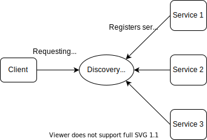

# Setup Maven Project
- Set up the parent maven project
  - Create an empty maven project (the `src` folder is not necessary, delete it)
  - Add required dependencies and plugins in `pom.xml` file.
- Set up the child modules
  - Each child module is a stand alone Spring Boot project (application).
  - Set up them individually
  - Expose the APIs which can be invoked by microservices in the system

# Microservice Setup
- Each service is a stand alone Spring Boot project. Develop them separately.
- When the service is up and running, it exposes itself to other services, so other services can call this service.
- Eureka framework provides ways to register and discover required services. With the help of Eureka, we can build a separate service (can be another stand alone Spring Boot project), which is "discovery service". This discovery service will act like a middle man between client (who wants to use a certain service) and the service (who provides the service), as shown in the following figure:

  

Terms:
- Discovery service
  - The service used to discovery other microservices
- Service
  - The microservice that is providing service (via APIs) to other components in the system (to client)
- Client
  - Client call the exposed APIs of services (consumer of other microservices). Client can be service too (i.e. provides APIs to other components in the system)

## Set up discovery server
- We can start with Spring initialzr. Create a new project with Eureka Server dependency added. In the `pom.xml` file, we should have following dependency:
  ```xml
  <dependency>
    <groupId>org.springframework.cloud</groupId>
    <artifactId>spring-cloud-starter-netflix-eureka-server</artifactId>
  </dependency>
  ```
- Add `@EnableEurekaServer` annotation to the main application class.
- Configure application properties. We need to tell the Eureka server don't register with other eureka server (to avoid console error messages). The default port of discovery server is 8761. The `application.yml` file:
  ```yml
  eureka:
    client:
      # tell eureka server that don't register with other eureka server (avoid console error messages)
      fetchRegistry: false
      registerWithEureka: false
  server:
    port: 8761
  ```
- Start the discovery server
  - Start the Spring Boot application. The Eureka dashboard can be accessed by the port (default: 8761) you specified in the properties file. For example, `localhost:8761`
  - After the discovery server is up and running, it accepts service registration and client request for service.


## Set up service to register with Eureka server
Steps to register a Spring Boot project (provides a service) to an Eureka server:
- Add Eureka client dependency:
  ```xml
  <dependency>
      <groupId>org.springframework.cloud</groupId>
      <artifactId>spring-cloud-starter-netflix-eureka-client</artifactId>
  </dependency>
  ```
- Add `@EnableEurakaClient` annotation to the Spring Boot application (optional if we use `spring-cloud-starter-netflix-eureka-client`).
- Define the name of the service and information of where to find the discovery service in properties file, for example:
  ```yml
  spring:
    application:
      name: movie-catalog-service
  eureka:
    client:
      serviceUrl:
        defaultZone: http://localhost:8761/eureka
  ```
  - If we do not specify the service url, the default `localhost:8761` will be used
- After the service is up and running, it will register itself with the Eureka discovery server

## Set up client to call services
Here, a client is the program that consumes APIs provided by services. There are two ways to consume an API in Spring Boot
- `RestTemplate`
- `WebClient` (asynchronous)

In this notes, we use `RestTemplate`.

Development steps:
- Define the discovery service url in application properties file if necessary (if not using the default value).
- Define a bean of type `RestTemplate`, we can define the bean in the class path. For example, create a configuration class.
- Add `@LoadBalanced` annotation to the method that produces the bean. This annotation tells Spring that the `RestTemplate` bean will find the service in an Eureka discover server using the provided service name, instead of using the actual uri of the service. Below is an example of `RestTemplate` bean defined:
  ```java
  @Configuration
  public class RestTemplateConfig {

      @Bean
      @LoadBalanced
      public RestTemplate restTemplate() {
          return new RestTemplate();
      }
  }
  ```
- When using `RestTemplate` to call the microservice, we provide the service name directly in the url, for example:
  ```java
  UserRating userRating = restTemplate.getForObject(
                  "http://movie-ratings-data-service/ratingsdata/user/" 
                  + userId, UserRating.class);
  ```
  - Here, `movie-ratings-data-service` is a service registered with discovery service.

# Microservice: Fault Tolerence and Resilience
## Introduction
- Fault tolerance
  - Given an application, what is the tolerance of the system for a fault. For example, if a microservice goes down, what could happen in the system?
- Resilience
  - How many faults can a system tolerate, how resilient is the system? How much the system can "bounce back" if there are faults, if there is a mechanism for the system to recover from the fault.

# Notes
- Two ways to call a REST API in Spring Boot
  - Use `RestTemplate` (will be deprecated in future)
  - Use `WebClient`: reactive programming. But you can still use `block()` to act sequentially
- Better use a wrapper class to wrap the return object of an API (if it is a collection, e.g. a list)
- Spring Cloud uses client side discovery (using a discovery server)
  - Client calls discovery server to get the URLs of the microservice
  - The actual call happens in the client
- Setting up Eureka server
  - Eureka server is a separate Spring Boot application, we should add the `spring-cloud-starter-netflix-eureka-server` artifact to the project (to use the netflix Eureka library) (add dependency in `pom.xml` file).
  - In addition to `@SpringBootApplication`, we also add `@EnableEurekaServer` annotation to tell Spring Boot that this project is used as an eureka server.
- Setting up Eureka client
  - Add `spring-cloud-starter-netflix-eureka-client` artifact dependency in `pom.xml` file.
  - Add `@EnableEurakaClient` to the Spring Boot application (optional if we have the `spring-cloud-starter-netflix-eureka-client` dependency on the classpath.)
  - Application properties configuration
    - Configure the application name (to be registered with the eureka server)
    - Configure where to register this client to the eureka server, for example
      ```yml
      eureka:
        client:
          serviceUrl:
            defaultZone: http://localhost:8761/eureka/
      ```
  - Add `@LoadBalanced` annotation to the `RestTemplate` bean in the project (that are used to invoke APIs provided by other microservices)
  - When using the `RestTemplate`, we do not provide the actual url for the API, instead, we use the name of the microservice to replace the url. What happens behind the scene is that the Eureka client will ask Eureka server to give the url of the corresponding microservice and then the client performs the API call using the actual url (client cache this result, the refresh time is 30 seconds).
  - The microservice url is hard-coded. We can put it into a property file though.


- Set Java system properties via command line
  - You can use `java -D` to specify the system property. For example, the server port: `java -Dserver.port=8079`. In windows terminal, you need to escape `.` character using double quotation: `java -Dserver"."port=8079`
# References
- [Can't connect to Eureka server (ConnectException)](https://stackoverflow.com/questions/56114871/cannot-connect-to-eureka-server-exception-java-net-connectexception-connectio)
- [Configure eureka server and client](https://stackoverflow.com/questions/45615866/changing-default-port-of-eureka-server-using-spring-cloud)

# TODOs
- [x] Create get user movie ratings API (input: userId, output: a list of movies of this particular user, wrapped in an object)
  - [x] Create a wrapper class for the list of user ratings
  - [x] Create the API (return some random dummy data)
- [x] Service discovery
  - [x] Set up Eureka server
